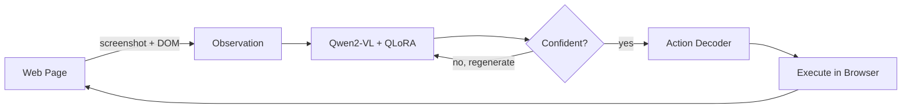

# Web VLA Agent

**End-to-End Vision-Language-Action Agent for Autonomous Web Navigation**

A multimodal agent that sees, understands, and acts on real web pages — trained end-to-end on human demonstrations using Qwen2-VL as its backbone.

| | |
|---|---|
| **Model** | Qwen2-VL-2B-Instruct (QLoRA fine-tuned) |
| **Dataset** | Multimodal-Mind2Web (137 websites, 31 domains) |
| **Actions** | CLICK · TYPE · SELECT · SCROLL · DONE |
| **Python** | 3.10+ |
| **License** | MIT |

---

## Table of Contents

1. [What It Does](#what-it-does)
2. [Architecture Overview](#architecture-overview)
3. [Project Structure](#project-structure)
4. [Component Details](#component-details)
5. [Installation](#installation)
6. [Usage](#usage)
7. [Configuration](#configuration)
8. [Training Guide](#training-guide)
9. [Evaluation](#evaluation)
10. [Action Space](#action-space)
11. [Research Highlights](#research-highlights)

---

## What It Does

Given a natural language instruction like *"Book a one-way flight from NYC to LA for next Friday"*, the agent:

1. **Observes** the webpage — captures a screenshot and extracts the DOM tree
2. **Reasons** about which element to interact with — using a multimodal transformer
3. **Acts** — clicks, types, selects, or scrolls on the page
4. **Repeats** — loops until the task is complete or max steps are reached

---

## Architecture Overview

The system follows a **perceive → reason → act** loop:



### How the Model Works

The core is a **Qwen2-VL-2B** multimodal transformer, fine-tuned with 4-bit QLoRA:

```
Inputs:
  ┌─────────────────┐   ┌──────────────────────────────┐
  │  Screenshot      │   │  Structured DOM + Task +      │
  │  (Vision Encoder)│   │  Action History (Tokenizer)   │
  └────────┬────────┘   └──────────────┬───────────────┘
           │                           │
           └───────────┬───────────────┘
                       ▼
           ┌───────────────────────┐
           │  Cross-Attention       │
           │  Transformer (QLoRA)   │
           │                        │
           │  All tokens attend to  │
           │  all other tokens      │
           └───────────┬───────────┘
                       ▼
           ┌───────────────────────┐
           │  Autoregressive JSON   │
           │  Action Generation     │
           └───────────────────────┘

Output:
  {"action": "CLICK", "element_id": 32}
```

### QLoRA Setup

| Parameter | Value |
|-----------|-------|
| Quantization | 4-bit NF4 |
| LoRA rank (r) | 16 |
| LoRA alpha | 32 |
| LoRA dropout | 0.05 |
| Target modules | q/k/v/o_proj, gate/up/down_proj |

---

## Project Structure

```
web_vla_agent/
│
├── main.py                       # CLI entry point
├── pyproject.toml                # Package config & dependencies
├── configs/
│   └── default.yaml              # All hyperparameters
│
├── models/                       # MODEL LAYER
│   ├── vla_model.py              #   Qwen2-VL backbone + QLoRA
│   ├── action_decoder.py         #   JSON action parsing & validation
│   ├── prompt_builder.py         #   Multimodal prompt construction
│   └── uncertainty.py            #   Token-level confidence estimation
│
├── data/                         # DATA PIPELINE
│   ├── mind2web_loader.py        #   HuggingFace dataset loading
│   ├── preprocessing.py          #   DOM parsing & screenshot processing
│   ├── augmentation.py           #   Domain perturbation & augmentation
│   └── precompute_embeddings.py  #   Offline embedding cache
│
├── environment/                  # BROWSER INTERFACE
│   ├── playwright_env.py         #   Gym-like Playwright environment
│   └── dom_serializer.py         #   Structured DOM tokenization
│
├── training/                     # TRAINING
│   └── train_supervised.py       #   Multi-stage imitation learning
│
├── evaluation/                   # EVALUATION
│   └── evaluate.py               #   Metrics & reporting
│
├── inference/                    # INFERENCE
│   └── run_agent.py              #   End-to-end agent loop
│
├── memory/                       # SAFETY
│   └── failure_detector.py       #   Loop/stale/error detection
│
├── utils/                        # UTILITIES
│   ├── config.py                 #   Dataclass config system
│   └── logging.py                #   Structured JSON logging
│
└── tests/
    └── test_smoke.py             #   Smoke tests
```

---

## Component Details

### 1. Model Layer — `models/`

#### VLAModel (`vla_model.py`)

The multimodal backbone. Wraps Qwen2-VL with quantization and LoRA adapters.

**Key methods:**

- `load()` — Load base model with 4-bit quantization
- `apply_lora()` — Attach LoRA adapters to language + vision layers
- `generate(messages, image)` — Generate an action with optional log-prob extraction
- `generate_with_beams(messages, image, num_beams)` — Multi-beam generation for uncertainty
- `compute_loss(input_ids, labels, pixel_values)` — Cross-entropy loss for training
- `save_lora(path)` / `load_lora(path)` — Save and load LoRA weights

#### ActionDecoder (`action_decoder.py`)

Robust JSON parser for model outputs. Handles:

- Clean JSON
- JSON wrapped in markdown code fences
- JSON embedded in explanatory text
- Validation against valid DOM node IDs
- Normalization to canonical action format

#### PromptBuilder (`prompt_builder.py`)

Constructs the multimodal input prompt:

```
[SYSTEM]  → Agent role & available actions
[IMAGE]   → Screenshot (via vision processor)
[TASK]    → User's natural language instruction
[CONTEXT] → Current URL, page title
[HISTORY] → Previous actions taken
[DOM]     → Serialized DOM tokens (up to 12K chars)
[ACTION]  → "Generate the next action as JSON:"
```

#### TokenUncertainty (`uncertainty.py`)

Two confidence signals:

1. **Token Log Probability** — Average log-prob of generated tokens. Below threshold (-2.0) → regenerate.
2. **Beam Disagreement** — Check if beams agree on action type + element. Below 50% agreement → uncertain.

Threshold is calibrated on a validation set using percentile-based tuning.

---

### 2. Data Pipeline — `data/`

#### Mind2WebLoader (`mind2web_loader.py`)

Loads the [Multimodal-Mind2Web](https://huggingface.co/datasets/osunlp/Multimodal-Mind2Web) dataset from HuggingFace.

Each sample contains:

- **Task** — Natural language instruction (e.g., "Find flights from NYC to LA")
- **Website / Domain** — Source website and category
- **Raw HTML** — Full page source
- **Serialized DOM** — Structured token representation
- **Screenshot** — Page screenshot as PIL Image
- **Action** — Ground-truth action JSON
- **Action History** — Previous steps in the trajectory

Supports both **single-step samples** and **full trajectories** (multi-step).

#### Preprocessing (`preprocessing.py`)

- `DOMProcessor` — Parses HTML into structured `DOMElement` objects with bounding boxes, clickability heuristics, tree depth
- `ScreenshotProcessor` — Resize and normalize screenshots
- `crop_element_from_screenshot()` — Extract visual patches per element

#### Augmentation (`augmentation.py`)

Four strategies for domain generalization:

| Strategy | What It Does |
|----------|-------------|
| **DOM Perturbation** | Drop attributes (15%), remove nodes (5%), shuffle CSS classes (10%) |
| **Visual Augmentation** | Color jitter, random crop (85-100%), Gaussian blur |
| **Text Masking** | Replace 30% of element text with `[MASK]` tokens |
| **Consistency Loss** | Cosine similarity regularization between original & perturbed embeddings |

---

### 3. Browser Environment — `environment/`

#### BrowserEnvironment (`playwright_env.py`)

Gym-like interface wrapping Playwright:

```python
env = BrowserEnvironment(headless=True)
await env.start()

state = await env.reset(url="https://example.com")
# state.screenshot      → PIL Image
# state.serialized_dom  → structured DOM text
# state.action_history  → list of previous actions

new_state = await env.step(WebAction(action="CLICK", element_id=32))
```

Features:
- Full state extraction (DOM, screenshot, viewport info, URL, title)
- Action execution with error handling (click, type, select, scroll)
- Bounding box extraction via JavaScript
- Mock mode for testing without a browser

#### DOMSerializer (`dom_serializer.py`)

Converts raw DOM into structured tokens:

```
<node id=32 tag=button depth=3 bbox=(0.125,0.278,0.234,0.056)>
  text="Book Now"
  attrs: class="btn-primary" aria-label="Book flight"
</node>
```

Key features:
- Normalized bounding boxes (0–1 relative to viewport)
- Interactability detection (buttons, inputs, links, ARIA roles)
- Viewport-proximity sorting (visible elements first)
- Max 500 nodes, deterministic truncation

---

### 4. Training Pipeline — `training/`

#### VLATrainer (`train_supervised.py`)

Multi-stage imitation learning:

**Stage 1 — Single-Step Imitation** (5 epochs)
- Input: task + DOM + screenshot + empty history
- Target: ground-truth action JSON
- Each sample is an independent (state, action) pair

**Stage 2 — Multi-Step Imitation** (10 epochs)
- Input: task + DOM + screenshot + ground-truth history
- Target: next action JSON
- Trains on full trajectories with teacher forcing

**Stage 3 — RL Fine-Tuning** (optional, not active by default)

Training hyperparameters:

| Parameter | Value |
|-----------|-------|
| Optimizer | AdamW |
| Learning rate | 2e-4 |
| Weight decay | 0.01 |
| Warmup | 10% of steps |
| Precision | BF16 |
| Gradient clipping | Max norm 1.0 |
| Gradient accumulation | 4 steps |
| Effective batch size | 16 |

---

### 5. Evaluation — `evaluation/`

#### VLAEvaluator (`evaluate.py`)

Evaluates across three Mind2Web test splits:

| Split | What It Tests |
|-------|---------------|
| `test_task` | New tasks on seen websites |
| `test_website` | New websites in seen domains |
| `test_domain` | Entirely new domains |

Metrics computed:

| Metric | Description |
|--------|-------------|
| Element Accuracy | Correct target element grounding |
| Action Accuracy | Correct action type prediction |
| Full Match | Exact match (action + element + value) |
| Per-Action F1 | Precision/recall/F1 per action type |
| Parse Success Rate | Valid JSON output fraction |
| Mean Latency | Average inference time per step |
| Failure Breakdown | Distribution of error types |

---

### 6. Inference Engine — `inference/`

#### VLAAgent (`run_agent.py`)

End-to-end autonomous agent. The execution loop:

1. Extract browser state (DOM + screenshot)
2. Build multimodal prompt
3. Generate action via Qwen2-VL
4. Assess uncertainty (log-prob + beam disagreement)
5. If uncertain → regenerate (up to 2 retries)
6. Parse & validate JSON action
7. Execute action in browser
8. Check for failures (stale state, loops, errors)
9. Repeat until DONE or max steps

---

### 7. Safety — `memory/`

#### FailureDetector (`failure_detector.py`)

Monitors the agent for failure patterns:

| Failure Type | How It's Detected |
|-------------|-------------------|
| Stale State | 3+ consecutive unchanged page states |
| Error Page | Title/URL contains 404, 500, "not found", etc. |
| Action Loop | Repeating action pattern in sliding window of 4 |
| Timeout | Total steps exceed max (default: 30) |

---

### 8. Utilities — `utils/`

**Config** (`config.py`) — Hierarchical dataclass configuration with YAML overlay. Groups: Model, Training, Data, Environment, Uncertainty, Evaluation, Logging.

**Logging** (`logging.py`) — Console (human-readable) + file (JSON Lines) handlers, structured metric logging, `@timed` decorator and `timer()` context manager for profiling.

---

## Installation

**Prerequisites:**
- Python 3.10+
- CUDA GPU (~10GB VRAM for QLoRA)

```bash
# Clone
git clone https://github.com/simran-kalkeri/web-vla-agent.git
cd web-vla-agent/web_vla_agent

# Install
pip install -e .

# Install browser
playwright install chromium

# (Optional) Dev dependencies
pip install -e ".[dev]"
```

---

## Usage

### Train

```bash
python -m training.train_supervised
```

### Evaluate

```bash
python -m evaluation.evaluate \
    --checkpoint checkpoints/stage2_best \
    --splits test_task test_website test_domain
```

### Run the Agent

```bash
python -m inference.run_agent \
    --url "https://www.example.com" \
    --task "Find the contact page" \
    --checkpoint checkpoints/stage2_best
```

### Run Tests

```bash
pytest tests/ -v
```

---

## Configuration

All settings live in `configs/default.yaml`. Override with:

```bash
export VLA_CONFIG=/path/to/custom.yaml
```

Key sections:

```yaml
model:
  name: "Qwen/Qwen2-VL-2B-Instruct"
  use_qlora: true
  lora_r: 16
  quantization_bits: 4

training:
  stage1_epochs: 5
  stage2_epochs: 10
  learning_rate: 2.0e-4
  batch_size: 4
  bf16: true

data:
  dataset_name: "osunlp/Multimodal-Mind2Web"
  max_dom_nodes: 500

environment:
  headless: true
  viewport_width: 1280
  viewport_height: 720
  max_steps: 30

uncertainty:
  min_log_prob_threshold: -2.0
  beam_width: 3
```

---

## Training Guide

### Data

The pipeline downloads automatically from HuggingFace:

```python
from data.mind2web_loader import Mind2WebLoader

loader = Mind2WebLoader()
train_samples = loader.build_training_examples(split="train")      # single-step
trajectories  = loader.build_trajectories(split="train")           # multi-step
```

### Training Stages

```
Stage 1 (5 epochs)          Stage 2 (10 epochs)         Stage 3 (optional)
Single-step imitation  ───▶  Multi-step w/ history  ───▶  RL fine-tuning
Learn individual actions     Learn sequential decisions   Online improvement
```

### GPU Requirements

| Setup | VRAM Needed |
|-------|-------------|
| QLoRA 4-bit (default) | ~10 GB |
| Full fine-tune | ~20 GB |
| Batch 4 + grad accum 4 | ~12 GB |

---

## Evaluation

### Target Metrics

| Metric | Target |
|--------|--------|
| Element Accuracy | 35–45% |
| Recall@5 | ≥ 60% |
| Action Accuracy | ≥ 70% |
| Macro F1 | ≥ 0.6 |

---

## Action Space

| Action | JSON Format | Description |
|--------|------------|-------------|
| CLICK | `{"action": "CLICK", "element_id": 32}` | Click on element |
| TYPE | `{"action": "TYPE", "element_id": 15, "value": "Brooklyn"}` | Type text into field |
| SELECT | `{"action": "SELECT", "element_id": 8, "value": "Economy"}` | Select dropdown option |
| SCROLL | `{"action": "SCROLL", "direction": "down", "amount": 300}` | Scroll the page |
| DONE | `{"action": "DONE"}` | Task complete |

---

## Research Highlights

1. **End-to-End Multimodal Grounding** — Joint element grounding and action generation in a single autoregressive pass, unlike pipeline approaches that separate ranking from prediction.

2. **Structured DOM Tokenization** — Per-node tokens with normalized bounding boxes and viewport metadata, giving geometric and structural signals instead of flat HTML.

3. **Token-Level Uncertainty** — Generative log probabilities + beam disagreement for confidence-aware action selection, with validation-set calibration.

4. **Domain Perturbation** — DOM augmentation + visual augmentation + text masking + contrastive consistency loss for robust cross-domain transfer.

5. **Multi-Stage Curriculum** — Progressive training: single actions first, then sequential decision-making with action histories.

---

## License

MIT License. See [LICENSE](LICENSE) for details.

---

*Built with PyTorch, HuggingFace Transformers, and Playwright*
