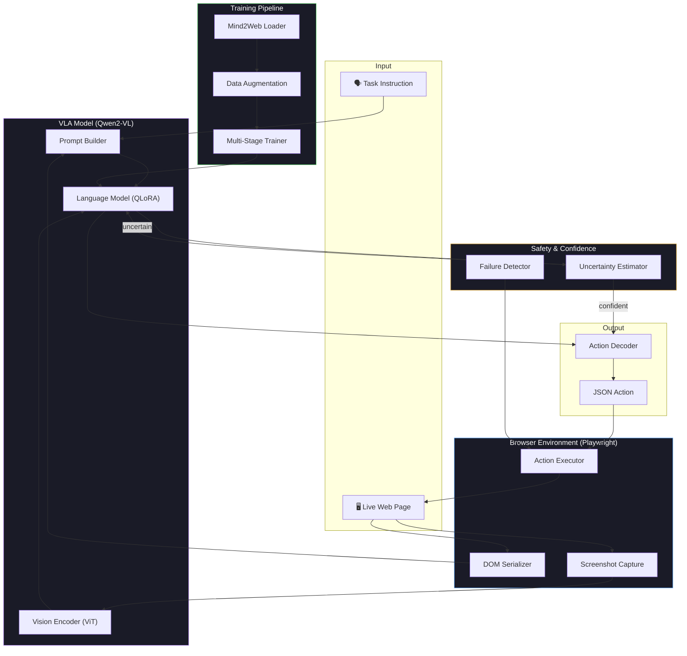
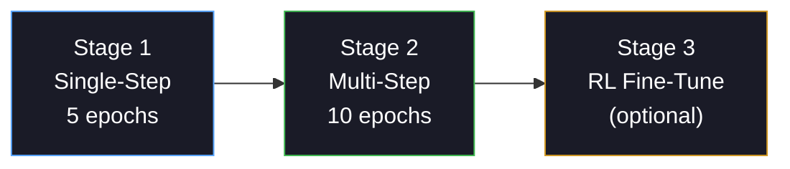

<](https://www.python.org/downloads/)
[](LICENSE)
[](https://huggingface.co/Qwen/Qwen2-VL-2B-Instruct)
[](https://huggingface.co/datasets/osunlp/Multimodal-Mind2Web)

*A multimodal agent that sees, understands, and acts on real web pages — trained end-to-end on human demonstrations.*

</div>

---

## 📋 Table of Contents

- [Overview](#overview)
- [Architecture](#architecture)
- [System Diagram](#system-diagram)
- [Project Structure](#project-structure)
- [Components](#components)
  - [Model Layer](#1-model-layer)
  - [Data Pipeline](#2-data-pipeline)
  - [Browser Environment](#3-browser-environment)
  - [Training Pipeline](#4-training-pipeline)
  - [Evaluation](#5-evaluation)
  - [Inference Engine](#6-inference-engine)
  - [Memory & Safety](#7-memory--safety)
  - [Utilities](#8-utilities)
- [Installation](#installation)
- [Quick Start](#quick-start)
- [Configuration](#configuration)
- [Training Guide](#training-guide)
- [Evaluation Guide](#evaluation-guide)
- [Action Space](#action-space)
- [Research Contributions](#research-contributions)
- [License](#license)

---

## Overview

**Web VLA Agent** is a Vision-Language-Action (VLA) system that autonomously navigates and interacts with real web pages. Given a natural language instruction (e.g., *"Book a one-way flight from NYC to LA for next Friday"*), the agent:

1. **Observes** the webpage via screenshot + structured DOM
2. **Reasons** about which element to interact with and how
3. **Acts** by clicking, typing, selecting, or scrolling
4. **Repeats** until the task is complete

The system uses **Qwen2-VL-2B-Instruct** as its multimodal backbone, fine-tuned with **QLoRA** (4-bit quantization + LoRA adapters) on the **Multimodal-Mind2Web** dataset — a large-scale collection of human web navigation demonstrations spanning 137 websites across 31 domains.

### Key Features

| Feature | Description |
|---------|-------------|
| 🧠 **Multimodal Understanding** | Jointly processes screenshots (visual) + DOM tree (structural) via full cross-attention |
| 🎯 **Structured Action Generation** | Outputs validated JSON actions via autoregressive decoding, not classification |
| 📊 **Uncertainty Estimation** | Token-level log probability + beam disagreement for confidence-aware decisions |
| 🔄 **Multi-Stage Training** | Stage 1: single-step imitation → Stage 2: multi-step trajectories with teacher forcing |
| 🛡️ **Failure Detection** | Heuristic loop/stale/error detection triggers replanning |
| 🧪 **Domain Augmentation** | DOM perturbation + visual augmentation for cross-domain generalization |
| ⚡ **Efficient Fine-Tuning** | 4-bit QLoRA enables training on consumer GPUs (< 16GB VRAM) |

---

## Architecture

The agent follows a **perceive → reason → act** loop built around a single multimodal transformer:

```
┌─────────────────────────────────────────────────────────────────┐
│                        VLA Agent Loop                           │
│                                                                 │
│  ┌──────────┐    ┌──────────────┐    ┌────────────────────┐     │
│  │  Browser  │───▶│  Observation │───▶│   Qwen2-VL + QLoRA │     │
│  │  (state)  │    │  (DOM + img) │    │   (reasoning)      │     │
│  └────▲─────┘    └──────────────┘    └────────┬───────────┘     │
│       │                                       │                 │
│       │          ┌──────────────┐              │                 │
│       │          │  Uncertainty │◀─────────────┤                 │
│       │          │  Estimator   │              │                 │
│       │          └──────┬───────┘              │                 │
│       │                 │ confident?           ▼                 │
│       │                 │              ┌──────────────┐          │
│       │                 └─────────────▶│ Action Decoder│          │
│       │                                │ (JSON parse) │          │
│       │                                └──────┬───────┘          │
│       │                                       │                 │
│       └───────────────────────────────────────┘                 │
│                    execute action                               │
└─────────────────────────────────────────────────────────────────┘
```

### Model Architecture

The core model is a **LLaVA-style multimodal transformer**:

```
Screenshot (PIL Image)         Structured DOM Text
        │                              │
        ▼                              ▼
┌───────────────┐            ┌──────────────────┐
│ Vision Encoder │            │   Text Tokenizer  │
│ (ViT patches)  │            │   (Qwen2 BPE)    │
└───────┬───────┘            └────────┬─────────┘
        │                              │
        ▼                              ▼
┌───────────────────────────────────────────────┐
│        Cross-Attention Transformer             │
│    (all tokens fully attend to each other)     │
│                                                │
│    [vision patches] [task] [DOM] [history]     │
│                                                │
│    QLoRA: 4-bit quantized weights              │
│    + LoRA on q/k/v/o + gate/up/down projections│
└───────────────────┬───────────────────────────┘
                    │
                    ▼
           JSON Action Token
    {"action": "CLICK", "element_id": 32}
```

---

## System Diagram



---

## Project Structure

```
web_vla_agent/
├── main.py                          # Entry point & CLI dispatcher
├── pyproject.toml                   # Package config & dependencies
├── configs/
│   └── default.yaml                 # Full configuration (model, training, data, env)
│
├── models/                          # 🧠 Core model layer
│   ├── vla_model.py                 # Qwen2-VL backbone with QLoRA (407 lines)
│   ├── action_decoder.py            # JSON action parser & validator (206 lines)
│   ├── prompt_builder.py            # Multimodal prompt construction (237 lines)
│   └── uncertainty.py               # Token-level confidence estimation (196 lines)
│
├── data/                            # 📦 Data pipeline
│   ├── mind2web_loader.py           # HuggingFace dataset loading & processing (493 lines)
│   ├── preprocessing.py             # DOM parsing & screenshot processing (274 lines)
│   ├── augmentation.py              # Domain perturbation & visual augmentation (277 lines)
│   └── precompute_embeddings.py     # Offline embedding cache for CPU efficiency
│
├── environment/                     # 🌐 Browser interface
│   ├── playwright_env.py            # Gym-like Playwright environment (613 lines)
│   └── dom_serializer.py            # Structured DOM → token serialization (411 lines)
│
├── training/                        # 🏋️ Training pipeline
│   └── train_supervised.py          # Multi-stage imitation learning (536 lines)
│
├── evaluation/                      # 📊 Evaluation metrics
│   └── evaluate.py                  # Comprehensive evaluation suite (359 lines)
│
├── inference/                       # 🚀 Inference engine
│   └── run_agent.py                 # End-to-end autonomous agent loop (330 lines)
│
├── memory/                          # 🛡️ Safety & memory
│   └── failure_detector.py          # Loop/stale/error detection (169 lines)
│
├── utils/                           # 🔧 Utilities
│   ├── config.py                    # Dataclass-based configuration system (144 lines)
│   └── logging.py                   # Structured JSON logging + profiling (127 lines)
│
└── tests/                           # ✅ Test suite
    └── test_smoke.py                # Smoke tests for all modules
```

---

## Components

### 1. Model Layer

#### `VLAModel` — *models/vla_model.py*

The core multimodal model wrapping **Qwen2-VL-2B-Instruct** with QLoRA fine-tuning.

| Method | Purpose |
|--------|---------|
| `load()` | Load base model with 4-bit quantization via `bitsandbytes` |
| `apply_lora()` | Attach LoRA adapters to language + vision-language merger layers |
| `generate()` | Autoregressive action generation with optional log-prob extraction |
| `generate_with_beams()` | Multi-beam generation for uncertainty estimation |
| `compute_loss()` | Token-level cross-entropy loss for training (with -100 masking) |
| `save_lora()` / `load_lora()` | Checkpoint LoRA adapter weights |

**QLoRA Configuration:**
- **Quantization**: 4-bit NF4 via `bitsandbytes`
- **LoRA rank**: 16, alpha: 32, dropout: 0.05
- **Target modules**: `q_proj`, `k_proj`, `v_proj`, `o_proj`, `gate_proj`, `up_proj`, `down_proj`

#### `ActionDecoder` — *models/action_decoder.py*

Robust JSON parser that handles real-world model outputs:
- Clean JSON, markdown-fenced JSON, JSON embedded in explanation text
- Action validation against valid DOM node IDs
- Action normalization to canonical form

#### `PromptBuilder` — *models/prompt_builder.py*

Constructs multimodal chat-format prompts following the structure:

```
[SYSTEM]  → Agent role & available actions
[IMAGE]   → Screenshot placeholder (filled by vision processor)
[TASK]    → User's natural language instruction
[CONTEXT] → Current URL, page title
[HISTORY] → Previous actions taken
[DOM]     → Serialized DOM tokens (structured, up to 12K chars)
[ACTION]  → "Generate the next action as JSON:"
```

#### `TokenUncertainty` — *models/uncertainty.py*

Confidence estimation via two complementary signals:

1. **Average Token Log Probability** — If avg log-prob < threshold (default: -2.0), trigger regeneration
2. **Beam Disagreement** — If < 50% of beams agree on action type + element, flag as uncertain

The threshold can be calibrated on a validation set using percentile-based tuning.

---

### 2. Data Pipeline

#### `Mind2WebLoader` — *data/mind2web_loader.py*

Loads the [osunlp/Multimodal-Mind2Web](https://huggingface.co/datasets/osunlp/Multimodal-Mind2Web) dataset from HuggingFace and produces structured training samples:

```python
@dataclass
class Mind2WebSample:
    sample_id: str          # Unique identifier
    task: str               # "Find one-way flights from NYC to LA"
    website: str            # "google.com/flights"
    domain: str             # "Travel"
    raw_html: str           # Full page HTML
    serialized_dom: str     # Structured DOM tokens
    screenshot: Image       # Page screenshot
    action: dict            # {"action": "CLICK", "element_id": 32}
    action_history: list    # Previous actions in trajectory
    step_index: int         # Position in multi-step trajectory
```

Also supports grouping samples into **trajectories** (`Mind2WebTrajectory`) for multi-step training with action histories.

#### `DOMProcessor` & `ScreenshotProcessor` — *data/preprocessing.py*

- **DOMProcessor**: Parses raw HTML into `DOMElement` dataclasses with tag, text, attributes, bounding box, clickability heuristics, and tree depth
- **ScreenshotProcessor**: Resizes and normalizes screenshots for the vision encoder
- **`crop_element_from_screenshot()`**: Extracts visual patches for individual DOM elements

#### Augmentation Pipeline — *data/augmentation.py*

Four augmentation strategies for domain generalization:

| Augmentation | What it does |
|-------------|-------------|
| **DOMPerturbation** | Randomly drops attributes (15%), removes nodes (5%), shuffles CSS classes (10%) |
| **VisualAugmentation** | Color jitter, random crop (85-100%), Gaussian blur |
| **TextMasking** | Replaces 30% of element text labels with `[MASK]` tokens |
| **Consistency Loss** | Cosine similarity regularization between original and perturbed embeddings |

---

### 3. Browser Environment

#### `BrowserEnvironment` — *environment/playwright_env.py*

A **gym-like interface** wrapping Playwright for real browser interaction:

```python
env = BrowserEnvironment(headless=True, viewport_width=1280, viewport_height=720)
await env.start()

state = await env.reset(url="https://example.com")
# state.screenshot → PIL Image
# state.serialized_dom → structured DOM tokens
# state.action_history → previous actions

new_state = await env.step(WebAction(action="CLICK", element_id=32))
```

**Key capabilities:**
- Full state extraction: DOM tree, screenshot, viewport info, page title/URL
- Action execution: click, type, select, scroll (with error handling)
- Bounding box extraction via JavaScript evaluation
- **Mock mode** for testing without a real browser

#### `DOMSerializer` — *environment/dom_serializer.py*

Converts raw DOM trees into structured token format optimized for the transformer:

```
<node id=32 tag=button depth=3 bbox=(0.125,0.278,0.234,0.056)>
  text="Book Now"
  attrs: class="btn-primary" aria-label="Book flight"
</node>
```

**Features:**
- Normalized bounding boxes (0–1 relative to viewport)
- Interactability detection (buttons, inputs, links, ARIA roles)
- Viewport-proximity sorting (visible elements first)
- Deterministic truncation (max 500 nodes)
- Non-visual tag filtering (script, style, meta, etc.)

---

### 4. Training Pipeline

#### `VLATrainer` — *training/train_supervised.py*

Multi-stage imitation learning trainer:

##### Stage 1: Single-Step Imitation
```
Input:  task + DOM + screenshot + empty history
Target: ground-truth action JSON
Loss:   token-level cross-entropy
```
Each sample is an independent (state, action) pair. The model learns to ground elements and predict individual actions.

##### Stage 2: Multi-Step Imitation (Teacher Forcing)
```
Input:  task + DOM + screenshot + ground-truth action history
Target: next action JSON
Loss:   token-level cross-entropy
```
Trains on full trajectories. Each step includes the ground-truth action history from prior steps, teaching the model to leverage context.

##### Stage 3: RL Fine-Tuning *(optional, configured but not yet active)*

**Training Details:**
- **Optimizer**: AdamW (lr: 2e-4, weight decay: 0.01)
- **Schedule**: Linear warmup (10% of steps) + linear decay
- **Precision**: BF16 mixed precision
- **Gradient clipping**: Max norm 1.0
- **Gradient accumulation**: 4 steps (effective batch size: 16)

---

### 5. Evaluation

#### `VLAEvaluator` — *evaluation/evaluate.py*

Comprehensive evaluation across Mind2Web's three test splits:

| Split | Tests |
|-------|-------|
| `test_task` | New tasks on seen websites |
| `test_website` | New websites in seen domains |
| `test_domain` | Entirely new domains |

**Metrics computed:**

| Metric | Description |
|--------|-------------|
| Element Accuracy | Correct target element grounding |
| Action Accuracy | Correct action type prediction |
| Full Match Accuracy | Exact match (action + element + value) |
| Per-Action F1 | Precision/recall/F1 per action type (CLICK, TYPE, SELECT, SCROLL) |
| Parse Success Rate | Fraction of outputs that parse as valid JSON |
| Mean Latency | Average inference time per step |
| Failure Breakdown | Distribution of error types |

---

### 6. Inference Engine

#### `VLAAgent` — *inference/run_agent.py*

The end-to-end autonomous agent that ties everything together:

```python
agent = VLAAgent(device="cuda")
agent.load_model(checkpoint="checkpoints/stage2_best")

result = await agent.run_task(
    url="https://www.google.com/flights",
    task="Book a one-way flight from NYC to LA for next Friday",
    max_steps=30,
)

print(result["success"])       # True/False
print(result["total_steps"])   # Number of actions taken
print(result["steps"])         # Detailed step-by-step log
```

**Agent Loop:**
1. Extract browser state (DOM + screenshot)
2. Build multimodal prompt
3. Generate action via Qwen2-VL
4. Assess uncertainty (log-prob + beam disagreement)
5. If uncertain → regenerate (up to 2 retries)
6. Parse & validate JSON action
7. Execute action in browser
8. Check for failure patterns (stale/loop/error)
9. Repeat until `DONE` or max steps reached

---

### 7. Memory & Safety

#### `FailureDetector` — *memory/failure_detector.py*

Heuristic failure detection that monitors the agent's behavior:

| Failure Type | Detection Method |
|-------------|-----------------|
| **Stale State** | 3+ consecutive unchanged page states (by MD5 hash) |
| **Error Page** | Title/URL contains 404, 500, "not found", "forbidden", etc. |
| **Action Loop** | Repeating action pattern within a sliding window of 4 |
| **Timeout** | Total steps exceed `max_steps` (default: 30) |

---

### 8. Utilities

#### Configuration System — *utils/config.py*

Hierarchical dataclass-based configuration with YAML overlay:

```python
from utils.config import load_config

cfg = load_config("configs/default.yaml")
print(cfg.model.name)              # "Qwen/Qwen2-VL-2B-Instruct"
print(cfg.training.learning_rate)  # 2e-4
print(cfg.environment.headless)    # True
```

Configuration groups: `ModelConfig`, `TrainingConfig`, `DataConfig`, `EnvironmentConfig`, `UncertaintyConfig`, `EvaluationConfig`, `LoggingConfig`.

#### Logging — *utils/logging.py*

- **Console**: Human-readable format with timestamps
- **File**: JSON Lines (`.jsonl`) with structured metric logging
- **Profiling**: `@timed` decorator and `timer()` context manager

---

## Installation

### Prerequisites

- Python 3.10+
- CUDA-capable GPU (4-bit quantization requires NVIDIA GPU)
- ~10GB VRAM minimum (Qwen2-VL-2B with QLoRA)

### Install

```bash
# Clone the repository
git clone https://github.com/simran-kalkeri/web-vla-agent.git
cd web-vla-agent

# Install the package
cd web_vla_agent
pip install -e .

# Install Playwright browsers
playwright install chromium

# (Optional) Install dev dependencies
pip install -e ".[dev]"
```

---

## Quick Start

### 1. Run the Agent (Inference)

```bash
cd web_vla_agent
python -m inference.run_agent \
    --url "https://www.example.com" \
    --task "Find the contact page and get the email address" \
    --checkpoint checkpoints/stage2_best
```

### 2. Train the Model

```bash
cd web_vla_agent
python -m training.train_supervised
```

### 3. Evaluate

```bash
cd web_vla_agent
python -m evaluation.evaluate \
    --checkpoint checkpoints/stage2_best \
    --splits test_task test_website test_domain
```

### 4. Run Tests

```bash
cd web_vla_agent
pytest tests/ -v
```

---

## Configuration

The full configuration is in `configs/default.yaml`:

```yaml
model:
  name: "Qwen/Qwen2-VL-2B-Instruct"
  use_qlora: true
  lora_r: 16
  quantization_bits: 4
  action_types: ["CLICK", "TYPE", "SELECT", "SCROLL"]

training:
  stage1_epochs: 5          # Single-step imitation
  stage2_epochs: 10         # Multi-step with teacher forcing
  learning_rate: 2.0e-4
  batch_size: 4
  bf16: true

data:
  dataset_name: "osunlp/Multimodal-Mind2Web"
  max_dom_nodes: 500

environment:
  headless: true
  viewport_width: 1280
  viewport_height: 720
  max_steps: 30

uncertainty:
  min_log_prob_threshold: -2.0
  beam_width: 3
  max_regenerations: 2
```

Override via environment variable:
```bash
export VLA_CONFIG=/path/to/custom_config.yaml
```

---

## Training Guide

### Data Preparation

The training pipeline automatically downloads from HuggingFace:

```python
from data.mind2web_loader import Mind2WebLoader

loader = Mind2WebLoader(dataset_name="osunlp/Multimodal-Mind2Web")

# Single-step samples
train_samples = loader.build_training_examples(split="train")

# Multi-step trajectories
trajectories = loader.build_trajectories(split="train")
```

### Training Stages



### GPU Requirements

| Setup | VRAM | Notes |
|-------|------|-------|
| QLoRA 4-bit (Qwen2-VL-2B) | ~10GB | Default — works on RTX 3080/4070 |
| Full fine-tune (Qwen2-VL-2B) | ~20GB | Requires A100/A6000 |
| Batch size 4 + grad accum 4 | ~12GB | Effective batch size: 16 |

---

## Evaluation Guide

### Running Evaluation

```python
from evaluation.evaluate import VLAEvaluator

evaluator = VLAEvaluator()

# Evaluate step-by-step
result = evaluator.evaluate_step(
    predicted={"action": "CLICK", "element_id": 32},
    ground_truth={"action": "CLICK", "element_id": 32},
)

# Compute all metrics
metrics = evaluator.compute_metrics()
evaluator.print_report(metrics)
```

### Target Metrics

| Metric | Target | Description |
|--------|--------|-------------|
| Element Accuracy | 35–45% | Correct element grounding |
| Recall@5 | ≥ 60% | Target in top-5 predictions |
| Action Accuracy | ≥ 70% | Correct action type |
| Macro F1 | ≥ 0.6 | Balanced across action types |

---

## Action Space

The agent outputs structured JSON actions:

| Action | Format | Example |
|--------|--------|---------|
| **CLICK** | `{"action": "CLICK", "element_id": <id>}` | Click "Submit" button |
| **TYPE** | `{"action": "TYPE", "element_id": <id>, "value": "<text>"}` | Type "Brooklyn" in search box |
| **SELECT** | `{"action": "SELECT", "element_id": <id>, "value": "<option>"}` | Select "Economy" from dropdown |
| **SCROLL** | `{"action": "SCROLL", "direction": "<up\|down>", "amount": <px>}` | Scroll down 300px |
| **DONE** | `{"action": "DONE"}` | Task completed |

---

## Research Contributions

This project addresses several key challenges in web agent research:

1. **End-to-End Multimodal Grounding** — Unlike pipeline approaches that separate element ranking from action prediction, our model jointly grounds elements and generates actions through a single autoregressive pass.

2. **Structured DOM Tokenization** — Instead of flat HTML, we serialize DOM nodes with normalized bounding boxes and viewport metadata, giving the model geometric and structural signals.

3. **Token-Level Uncertainty** — Rather than classification-based confidence, we use generative token log probabilities and beam disagreement to assess action confidence.

4. **Domain Perturbation** — DOM augmentation (attribute dropping, class shuffling, node removal) + visual augmentation + text masking + contrastive consistency loss for cross-domain robustness.

5. **Multi-Stage Training** — Progressive curriculum: learn single actions first, then learn to use action history for sequential decision-making.

---

## License

This project is licensed under the MIT License. See the [LICENSE](LICENSE) file for details.

---

<div align="center">

*Built with 🔥 PyTorch, 🤗 Transformers, and 🎭 Playwright*

</div>
]]>
